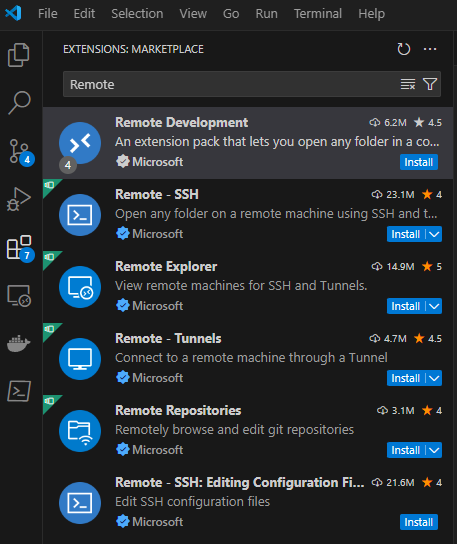
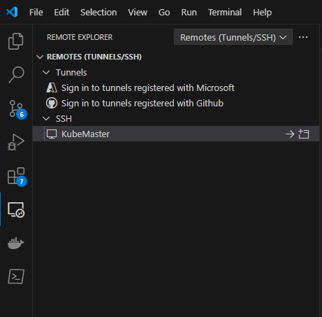

<!--
SPDX-FileCopyrightText: © 2024 Siemens Healthineers AG
SPDX-License-Identifier: MIT
-->

# Linux Remote Development with K2s

With the usage of the [Remote Extension](https://code.visualstudio.com/docs/remote/remote-overview) of Visual Studio Code it is possible to enable linux development using K2s. Via SSH the Remote Extension connects to the VM created by K2s to create a seamless linux development environment.

## Installation

As already said, the Remote Development relies on the Remote Extension that can be acquired in the VS Code Extension Marketplace. Search for Remote Development and install the: [Remote Development Extension Pack](https://marketplace.visualstudio.com/items?itemName=ms-vscode-remote.vscode-remote-extensionpack).




## Usage

To use the Remote Extension, head to the Remote Explorer in VS Code and connect to the KubeMaster.

!!! tip
    Make sure Remotes (Tunnels/SSH) is selected in the dropdown menu.




!!! tip
    If the connection is not possible, try to update VS Code to a newer version.


After connecting to the KubeMaster VM, it's now possible to open a shell on the remote host via VS Code. 
From there it's possible to install the different tools needed for development e.g. `git`:

```Console
sudo apt-get install git
```

If you want to clone a git repository, please make sure to configure `git` to use the proxy to communicate with the internet:

```Console
git config --global http.proxy http://172.19.1.1:8181
```

